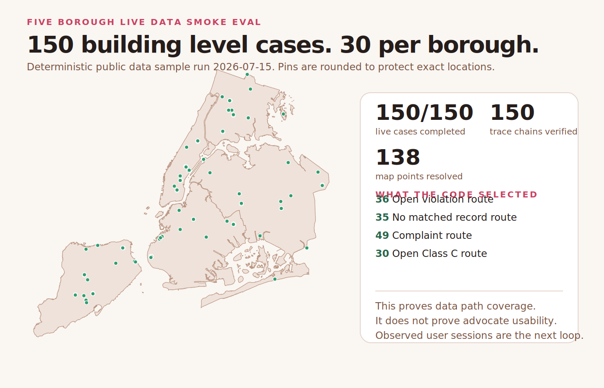

# Shakti Seva Studio

Shakti helps a person check what New York City housing records say about one
building. A person types an address in the form they already know. The app finds
the City building record, loads selected public records, shows when each source
was fetched, and keeps complaints separate from violations.

This repository documents the product decisions, interface design, engineering
work, and evidence behind that flow. It is written for people who want to use
technology for public work and want to show what their software actually does.

Shakti is a research prototype. It is not a City service. It does not file a
complaint, give legal advice, score a landlord, or predict an agency action.

## Choose the public or local edition

| Edition | What runs | AI | Best for |
| --- | --- | --- | --- |
| [Public web demo](https://shakti-seva-studio.netlify.app) | Static browser files and three Netlify Functions that call live City services | None | Trying the address and source workflow without installing anything |
| Local research edition | Python, FastAPI, WebSocket, local traces, and optional Hermes | Off by default; explicitly enabled locally | Extending the case packet, studying agent behavior, and instrumenting local tool use |

The public demo is deterministic civic software. Address matching, City joins,
privacy treatment, record limits, counts, and the recommended next step are
ordinary code. Its `/api/health` response reports `ai.enabled: false`, and its
result page says the same thing on screen. Downloading the repository adds the
local research tools; it does not make AI necessary for the public workflow.

## What works today

A person can type a New York City address and press Enter. The browser requests
ranked address suggestions from [NYC GeoSearch](https://geosearch.planninglabs.nyc/docs/).
If there is a match, Shakti uses the selected NYC Building Identification Number
to find the property in HPD data. This avoids a second guess about street names.

The app then loads selected fields from these NYC Open Data sources:

| Source | Dataset | Use |
| --- | --- | --- |
| [HPD Buildings](https://data.cityofnewyork.us/d/kj4p-ruqc) | `kj4p-ruqc` | Resolve the HPD Building ID and canonical property address |
| [HPD Complaints and Problems](https://data.cityofnewyork.us/d/ygpa-z7cr) | `ygpa-z7cr` | Show complaint dates, categories, and public status text |
| [Housing Maintenance Code Violations](https://data.cityofnewyork.us/d/wvxf-dwi5) | `wvxf-dwi5` | Show violation class, status, inspection date, and correction date |
| [Alternative Enforcement Program Buildings](https://data.cityofnewyork.us/d/hcir-3275) | `hcir-3275` | Show whether the building appears in the selected enforcement dataset |

Each result shows the dataset, fetch date, number of rows returned, public record
identifiers, and a processing trace. The app removes apartment identifiers from
the address before autocomplete. It also removes unit locations that appear in
public description text before a case reaches the optional model.

## One verified address

On July 15, 2026, we typed this address and pressed Enter:

```text
700 E 9th Street, Manhattan
```

NYC GeoSearch returned `700 EAST 9 STREET, New York, NY` with NYC BIN
`1004529`. HPD uses the corner address `140 Avenue C, Manhattan` for the same
BIN. Shakti displayed that difference and loaded HPD Building `6533`.

The live result showed 25 complaints and 6 open violations. At least one open
violation was Class C. The code therefore selected this next step: follow up
with HPD about the open Class C violation. The model did not select that step.

This check proves that natural address entry, City address matching, the HPD
join, data treatment, routing, and source receipts worked for this address at
that time. It does not prove that every City address will resolve. It does not
prove that an advocate will make fewer errors or finish work faster.

The safe fields from this run are preserved in the checked
[live address baseline](evals/baseline/live-address.json). Raw City rows and the
full trace remain local.

## Try the public web demo

Open [shakti-seva-studio.netlify.app](https://shakti-seva-studio.netlify.app)
and type a New York City address. The hosted version uses HTTPS functions for
NYC GeoSearch and Open Data. It does not include Python, WebSockets, Hermes, or
Bonsai. Address suggestions and case requests use POST bodies that are not cached.
The functions do not intentionally log those bodies or persist the returned
trace. Netlify still processes normal infrastructure metadata as the hosting
provider.

Read the [Netlify deployment guide](docs/netlify-deployment.md) for the exact
runtime boundary, endpoints, build, tests, risks, and custom domain path.

## Run the local research edition

You need Python 3.13 and `uv`.

```bash
python3 scripts/bootstrap.py
.venv/bin/shakti doctor
.venv/bin/shakti serve
```

Open [http://127.0.0.1:8765](http://127.0.0.1:8765). Type a New York City
address and press Enter. The server accepts connections from this computer only.

Check the result before you trust it:

1. Confirm that the address shown by HPD is the building you intended.
2. Open the source section and check each dataset and fetch date.
3. Keep complaints and violations separate when you explain the record.
4. Use the official [NYC Tenant Protection resources](https://www.nyc.gov/content/tenantprotection/pages/)
   if the person needs City support.

## Product contract

The first product promise is simple. A person should type an address as they
would in a common map product and get a clear result or a clear reason why the
address could not be resolved.

The current contract is:

- A borough and ZIP code are optional.
- Pressing Enter uses the best live NYC address match when one is available.
- A person may choose a different ranked suggestion before searching.
- Shakti shows address aliases when GeoSearch and HPD name the same property
  differently.
- Shakti does not join repair records until it has one HPD building record.
- Missing records remain missing. The app does not call them repaired.
- The model cannot choose the next step or add facts to the case packet.

## Design decisions

The address field uses a forgiving format and ranked suggestions. The interface
shows the address it will search before it loads repair records. If HPD uses a
different property address, the result teaches the match as a three part visual:
the address a person knows, the NYC BIN that identifies the building, and HPD's
filing address. The explanation links to the City's definition of a BIN and only
claims a match when both records share that identifier.

The web interface uses live public data. Test fixtures do not appear in the
public demo.

The result begins with the selected next step, followed by record totals and a
dated timeline. Source receipts and processing events remain available in the
same page. This order gives a community advocate a short answer while keeping
the evidence close enough to inspect.

The interface ends with official City support. Shakti does not replace 311,
HPD, a tenant organization, or legal counsel.

## Engineering decisions

The application separates deterministic data work from optional model work.

```text
typed address
  -> apartment identifier removed
  -> NYC GeoSearch suggestions
  -> person choice or top ranked match on Enter
  -> NYC BIN
  -> HPD Building ID
  -> selected complaints, violations, and enforcement records
  -> field treatment and record limits
  -> next step selected by code
  -> hash chained processing trace
  -> optional local model explanation
```

In the local edition, the browser sends autocomplete text to the loopback
server. In the hosted edition, it sends a POST body that is not cached to a Netlify
Function. Both runtimes remove apartment identifiers and call NYC GeoSearch.
Neither Shakti implementation saves or traces autocomplete text. After a person
chooses an address, the deterministic case service uses the NYC BIN to query
the HPD Buildings dataset.

The case service selects a fixed list of fields and limits the number of rows.
It hashes each query predicate and response. It removes fields that are outside
the case contract. It then chooses the next step with ordinary code.

Hermes receives the treated case packet. It does not receive raw dataset
responses or the autocomplete query. The evaluated local runtime uses a 32K
context expectation and a small case packet. Model use is off by default.

```bash
export SHAKTI_HERMES_ENABLED=1
.venv/bin/shakti hermes --tui
```

Read [architecture](docs/architecture.md), [data treatment](docs/data-treatment.md),
the [local AI extension guide](docs/local-ai-extension.md), and
[Hermes validation](docs/hermes-validation.md) before changing these boundaries.

## Evidence

The acceptance suite currently has 18 Python tests, 6 Node tests, and 9 Day 0 checks.
It covers field treatment, address search across boroughs, BIN lookup, same

```bash
PYTHONPATH=src .venv/bin/pytest -q
node --test netlify/tests/*.test.mjs
netlify build --offline
PYTHONPATH=src .venv/bin/python evals/run.py
```

The dated [five borough evaluation](docs/five-borough-eval.md) used 30 fixed HPD
building records in each borough. All 150 case pipelines, privacy scans, and
trace chains passed. The run found records that required unit location
redaction, cases that reached display limits, and buildings without a map point.



The [validation report](docs/validation-report.md) records the commands, dated
results, browser checks, media checks, and known gaps. Raw traces from live
addresses remain on the local computer and are ignored by Git.

## What has not been proved

Shakti has not completed a measured pilot with housing advocates or HPD. We do
not know whether it reduces preparation time or errors. The five borough sample
does not represent every building. A successful address match does not prove
that the underlying City record is complete or current.

NYC GeoSearch and NYC Open Data require a network connection. Their availability
and data quality are outside this repository. The app needs clearer behavior for
temporary service failures and for an address that has several valid building
records.

The local model boundary has startup and packet checks. It has not been proved
safe for every model at a full 32K context. The model remains optional because
the public record workflow works without it.

## How to contribute

Start with a problem that one person can test. State the public task, source,
join key, fields, privacy rules, code selected action, and expected result. Add a
synthetic fixture and tests before you use a live address.

Read [CONTRIBUTING.md](CONTRIBUTING.md) for the review path. Good first changes
include improving an unresolved address state, adding a privacy treatment test,
or documenting one live failure with enough detail to reproduce it.

## Reference material

Use the tests, dated reports, source receipts, and live reproduction commands as
evidence. The earlier fixture based videos were removed.

- [How we built this](docs/how-we-built-this.md)
- [Netlify deployment](docs/netlify-deployment.md)
- [Local AI and tool use](docs/local-ai-extension.md)
- [Engineering notes](docs/engineering-talk.md)
- [Public reference guide](docs/public-reference.md)
- [Citation file](CITATION.cff)
