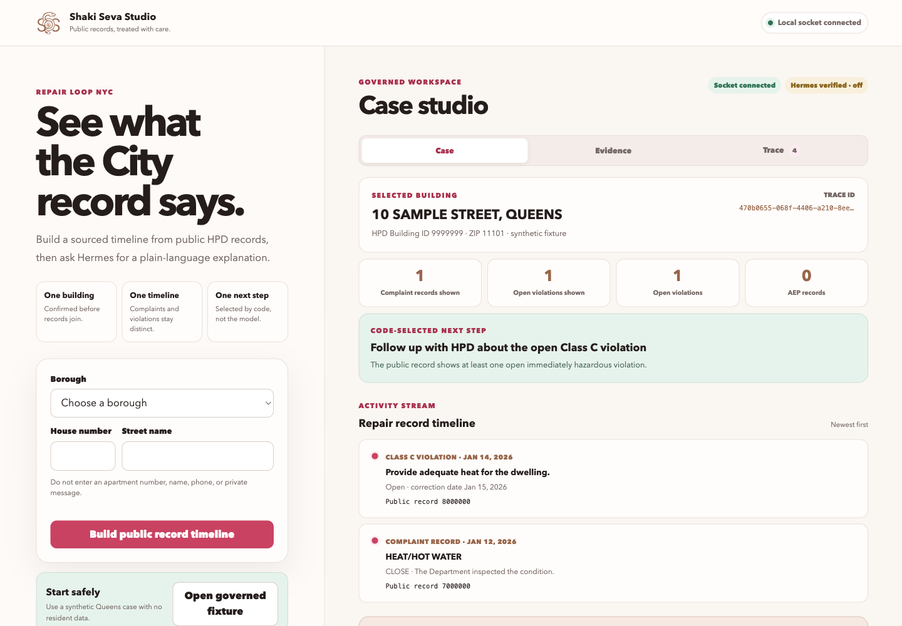
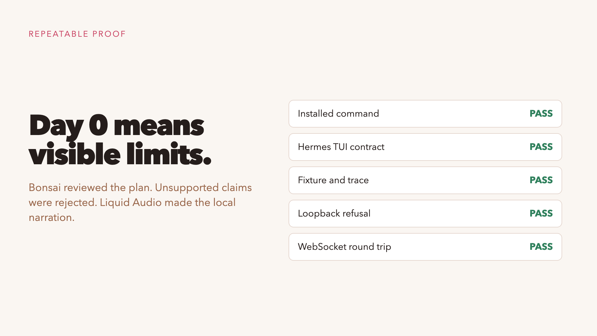

# Shaki Seva Studio

Shaki Seva Studio helps a New Yorker understand what public City records say
about a housing repair complaint. It joins a bounded set of NYC Open Data
records, preserves their provenance, applies deterministic routing rules, and
then lets Hermes explain the resulting case packet in plain language.

This is an early public-interest technology prototype. It does not file a 311
request, make an enforcement decision, score a landlord, or give legal advice.

## Why this architecture

The data plane and language plane are separate.

```text
resident input
  -> validated address or fixture
  -> deterministic NYC Open Data queries
  -> allowlisted fields and normalized records
  -> deterministic next-step rule
  -> hash-chained trace and curated case packet
  -> optional Hermes explanation
  -> CLI, Hermes TUI, or local web UI
```

Hermes never receives raw dataset dumps. It receives a compact packet with
source identifiers, freshness, observed statuses, and the next step selected
by code.

## Quick start

```bash
python3 scripts/bootstrap.py
.venv/bin/shaki doctor
.venv/bin/shaki case --fixture
.venv/bin/shaki serve
```

Open `http://127.0.0.1:8765`. The browser connects to the local server through
a WebSocket and shows the same case packet and trace as the CLI.

To launch the installed Hermes interfaces inside this governed workspace:

```bash
.venv/bin/shaki hermes --tui
.venv/bin/shaki hermes --cli
```

The wrapper starts Hermes with a 32K context expectation. This is the evaluated
operating target for the local fork, not a claim that every model or prompt is
safe at 32K.

Live Hermes explanations are disabled by default. Enable them only after the
runtime and model have been evaluated:

```bash
export SHAKI_HERMES_ENABLED=1
```

## Governance gates

- Every query and transformation produces a hash-chained JSON Lines event.
- Only allowlisted public fields enter a case packet.
- Apartment numbers and resident free text are excluded.
- Dataset IDs, fetch time, row counts, and response hashes are retained.
- The next step comes from code, not the model.
- Hermes execution is explicit, bounded, and off by default.
- A trace verifier detects changed or reordered events.

See [architecture](docs/architecture.md), [data treatment](docs/data-treatment.md),
[tracing](docs/tracing.md), [Hermes validation](docs/hermes-validation.md), and
the dated [validation report](docs/validation-report.md).

## Day 0 proof

The [Day 0 guide](docs/day-0.md) is the shortest path from a new checkout to a
verified local run. The [evaluation guide](docs/evaluation.md) explains each
automated check and what it does not prove.

```bash
.venv/bin/python evals/run.py
```

| Hermes TUI | Local web UI |
| --- | --- |
|  |  |

[](docs/assets/shaki-seva-day0.mp4)

The [Remotion demo](docs/assets/shaki-seva-day0.mp4) uses these captured screens.
Its narration was generated locally on the CPU with Liquid LFM2.5 Audio. The
production source and the local Bonsai review record are in [`demo/`](demo/).

## Public datasets

- HPD Buildings: `kj4p-ruqc`
- HPD Complaints and Problems: `ygpa-z7cr`
- Housing Maintenance Code Violations: `wvxf-dwi5`
- Alternative Enforcement Program Buildings: `hcir-3275`

The fixture is synthetic. No resident record is committed to this repository.

## Project status

The deterministic fixture, trace chain, CLI, WebSocket server, and web
interface are the first acceptance target. A live model run is a separate gate
and must not be inferred from those checks.

## Security and contributions

Read [SECURITY.md](SECURITY.md) before using live addresses or enabling Hermes.
Dataset and field changes must follow [CONTRIBUTING.md](CONTRIBUTING.md).
