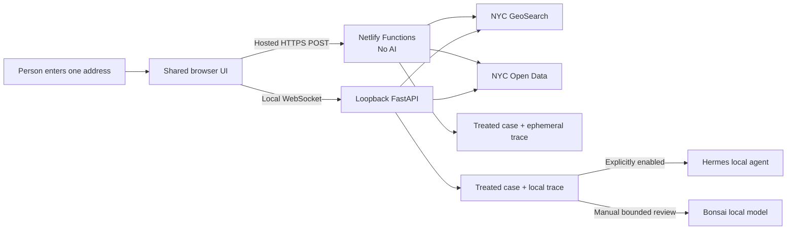

# Architecture

## Decision

Shakti Seva Studio uses a deterministic data plane and an optional local
generative explanation plane. The public deployment contains no AI runtime.
The local edition can pass the same treated case contract to Hermes after code
has finished the address match, joins, treatment, counts, and next step.

## Components

### Case service

The case service owns address normalization, query construction, identifier
joins, field selection, record limits, and routing. It returns a stable JSON
contract. It does not generate prose.

### Trace ledger

Every event contains the previous event hash. The ledger stores hashes for
query values. Curated public results can appear in the final packet, but
apartment fields and resident free text cannot.

### Hermes adapter

The adapter checks the installed Hermes version and required CLI flags. A live
run invokes `hermes chat` with a bounded turn count, a session source tag,
session ID injection, and checkpoints. The adapter passes only the curated
packet. It never passes raw Open Data responses.

### Local web server

FastAPI serves static assets on loopback and exposes `/ws`. The socket carries
typed progress, case, trace, and error messages. It does not expose a public
network listener by default. The server rejects non-loopback bind requests,
and the socket rejects browser handshakes whose `Origin` does not match the
requested local host.

The browser address picker calls the local `/api/address-suggestions` proxy
after three characters. The proxy removes apartment identifiers, requests up to
six NYC GeoSearch candidates, and returns five treated suggestions. Selecting a
suggestion supplies its NYC BIN to the case service, avoiding a second fuzzy
address interpretation. Autocomplete queries are not persisted or traced.

### Browser service map

The lookup interface has five service stages:

1. **Ask** accepts one street address and removes apartment information.
2. **Match** binds that address to one City building. A selected GeoSearch
   suggestion already carries a BIN, so an exact match completes this stage
   without showing a confirmation screen. Ambiguous results stop here until the
   person chooses one building.
3. **Read** shows the bounded complaint and violation record.
4. **Act** shows the deterministic next step and, in the local edition, the
   optional plain-language model explanation.
5. **Check** exposes source receipts and the processing trace.

`Where AI helps` is an educational page outside this service map. It must not
appear as a sixth lookup stage.

### Public serverless runtime

Netlify serves an allowlisted static build and three modern JavaScript
Functions:

- `/api/health` declares `ai.enabled: false` and the HTTPS runtime;
- `/api/address-suggestions` accepts a POST body that is not cached, removes any
  apartment suffix, and calls NYC GeoSearch; and
- `/api/case` resolves one City building, queries the four allowlisted datasets,
  applies field treatment and record caps, selects the next step with code, and
  returns a hash chained trace.

The function trace lives only in the response. The serverless implementation
does not create a database, invoke a model, retain a session, or accept a Hermes
request. Netlify processes normal hosting and function metadata; Shakti does
not intentionally log request bodies.

The Python and JavaScript services intentionally share the same public case
schema and governance constants. Tests across both runtimes cover the dataset IDs,
field treatment, record caps, deterministic route, and trace chain. They are
two implementations, so parity tests are a release requirement when either
data plane changes.

## Context policy

The expected model window is 32K tokens. Shakti targets a much smaller case
packet so the interface remains useful under pressure:

- instructions and tool schemas: up to 4K;
- curated City evidence: up to 8K;
- resident interaction and tool history: up to 8K;
- final explanation and safety reserve: at least 8K; and
- compaction or refusal before the complete conversation reaches 28K.

Raw logs, full building histories, and broad searches are outside the model
context.

## UI patterns

- Dashboard for case state and source freshness.
- Module Tabs for Case, Evidence, and Trace.
- Activity Stream for the chronological repair record.
- Progressive Disclosure for raw identifiers and governance details.
- Forgiving Format for complete pasted addresses.
- Autocomplete and Input Feedback for ranked, canonical NYC addresses.
- Blank Slate behavior for an unresolved live address.

The public lookup, applied RAG guide, and author page share one header, footer,
palette, typography system, and navigation model. The learning guide is a
secondary path. It must not interrupt the address task or imply that the hosted
lookup uses AI. See the [applied RAG information architecture](applied-rag-information-architecture.md).
