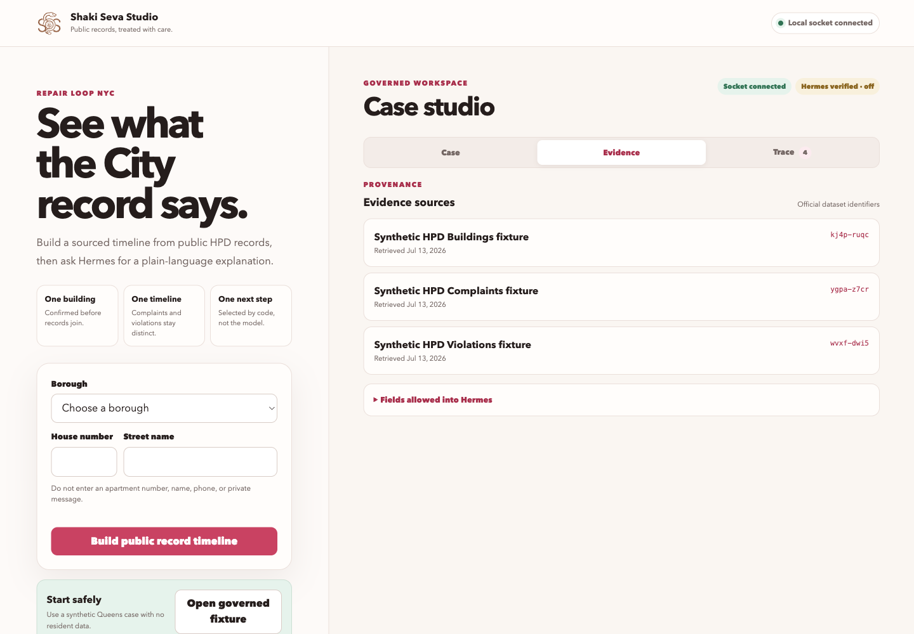
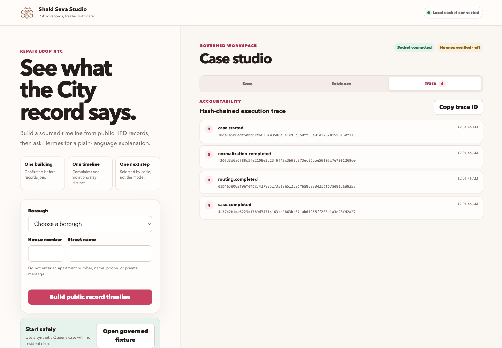

# Day 0 guide

Day 0 has one goal: prove that a new contributor can run the safe path and see
the same evidence without resident data or a model call.

## 1. Bootstrap

Use Python 3.13 and `uv`:

```bash
python3 scripts/bootstrap.py
```

The script creates `.venv`, installs the project in editable mode, verifies the
import, and runs `shaki doctor`. On macOS it also clears hidden flags that can
prevent Python from reading an editable-install path file on an external APFS
volume.

## 2. Run the synthetic case

```bash
.venv/bin/shaki case --fixture
```

The fixture is invented and stable. It exercises field selection, unit
treatment, record limits, deterministic routing, and the hash-chained trace.

## 3. Use the web UI

```bash
.venv/bin/shaki serve
```

Open `http://127.0.0.1:8765`, then load the fixture. Review all three views:

- Case keeps complaints and violations separate.
- Evidence identifies the source dataset IDs and fetch metadata.
- Trace displays the ordered, hashed processing steps.






The server refuses a public bind. Its browser socket accepts the same loopback
origin and rejects a cross-origin handshake.

## 4. Use Hermes

```bash
.venv/bin/shaki hermes --print-command --tui
.venv/bin/shaki hermes --tui
```

The wrapper supplies a 32K startup expectation to the evaluated local Hermes
fork. The screenshot proves that the TUI reached its ready state with the
workspace tools loaded. It does not prove model quality, a full 32K prompt, or
memory safety under inference load.


## 5. Run the acceptance suite

```bash
.venv/bin/python evals/run.py
```

Every required row must say `PASS`. The JSON report is written under
`output/evals/`. The checked-in [baseline](../evals/baseline/day0.json) records
the public Day 0 result without local paths.

## What Day 0 found

The work exposed two integration failures before documentation was written.
Python skipped an editable-install path file marked hidden on the external
volume. Hermes also enforced its upstream 64K startup floor against a 32K local
model. The bootstrap script handles the first issue. The governed wrapper and
the evaluated local fork expose explicit 32K startup controls for the second.

These fixes make startup repeatable. They do not turn a 32K model into a 64K
model or make an unbounded prompt safe.

## Stop conditions

Stop and investigate when the trace fails verification, a response contains a
unit identifier, the server binds beyond loopback, the browser reports a socket
origin error, or Hermes reports less context than the governed target. Do not
work around these failures by increasing model load.
