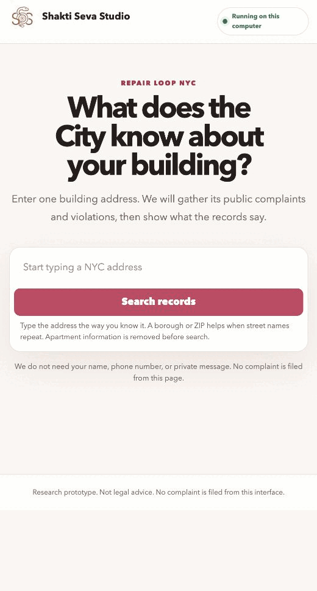
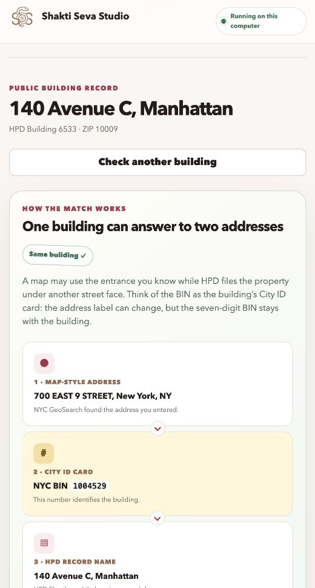
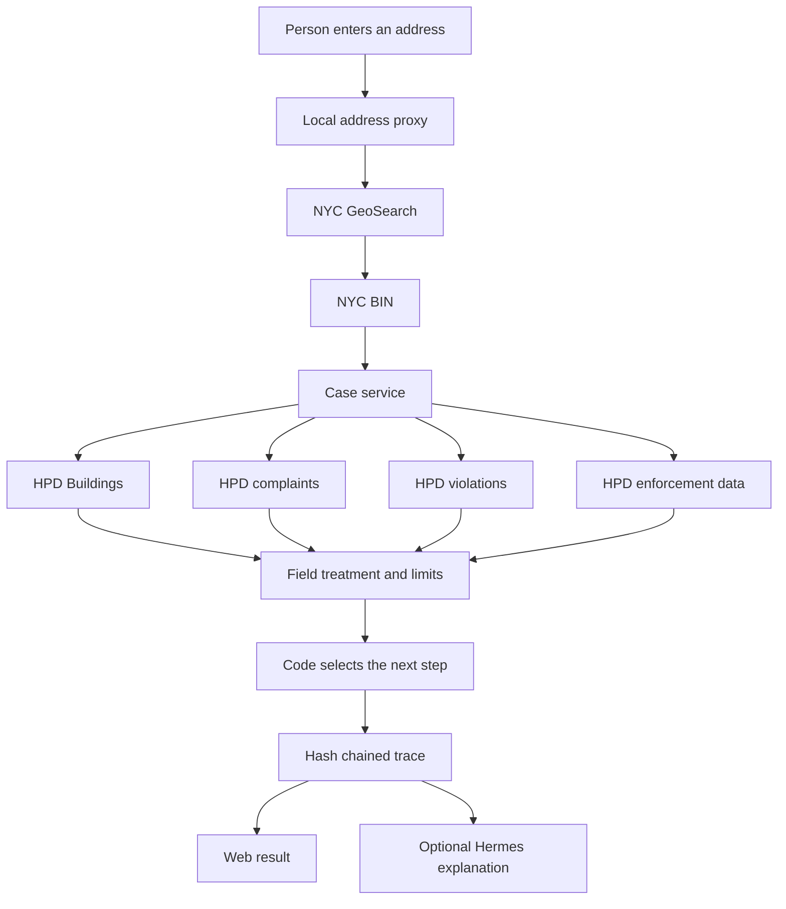
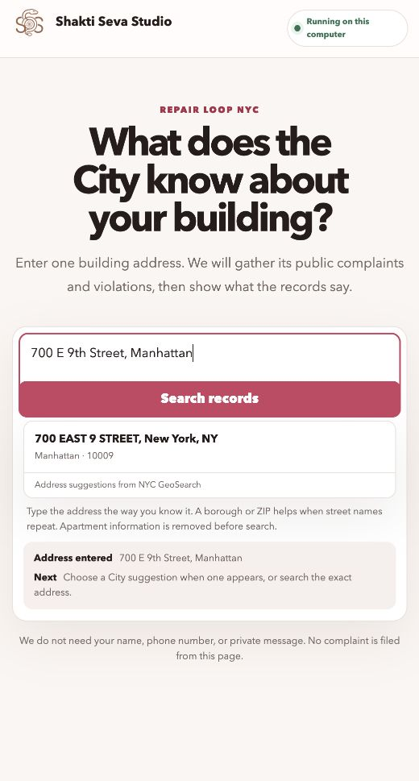
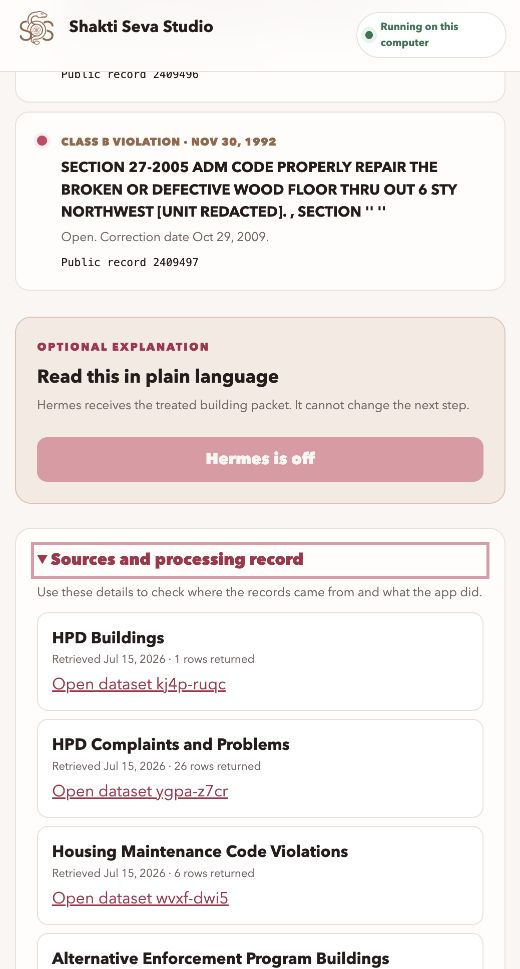
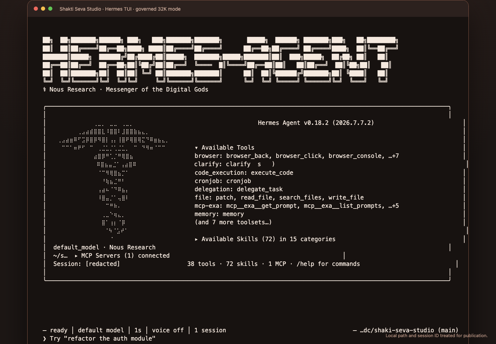

# How we built this

Shakti Seva Studio helps a person read selected New York City housing records
for one building. A person enters an address. The app finds the City building,
loads public records, removes fields that the product does not need, and shows
the result with source receipts. An optional local Hermes agent can explain the
treated result.

This article explains how each part works. It covers the data, repository,
browser, Hermes boundary, and deployment choices. It also states what we
measured and what we have not tested.



Every frame in this animation came from the running application on July 15,
2026. The address resolved through live City services. The result was not built
from a test fixture.

## Start with one public task

The first product task is narrow. A person should be able to type a building
address in the form they know and see what selected City records say about that
building.

This task has several failure points. A map address may differ from the address
that HPD uses. Public datasets may use different identifiers. Complaint text
may contain an apartment location. A missing record does not mean that a repair
happened. A language model may produce a clear sentence that is not supported
by the record.

We designed the data path before adding a model. The web app can complete the
public record task with the model turned off.

## Where the data comes from

The browser uses NYC GeoSearch for address suggestions. The selected suggestion
includes the City's Building Identification Number, which is called a BIN. The
BIN joins the address that a person knows to the building record that HPD uses.

The case service then queries four NYC Open Data datasets.

| Dataset | ID | Use |
| --- | --- | --- |
| HPD Buildings | `kj4p-ruqc` | Resolve the HPD Building ID and filing address |
| HPD Complaints and Problems | `ygpa-z7cr` | Load complaint dates, categories, and public status text |
| Housing Maintenance Code Violations | `wvxf-dwi5` | Load open violations, inspection dates, and correction dates |
| Alternative Enforcement Program Buildings | `hcir-3275` | Check whether the building appears in the selected enforcement data |

The application does not download each full dataset. It sends a bounded query
to the City API with an allowlist of fields. Each query has a row limit and a
timeout. Temporary rate limit and server errors receive a bounded retry.

### Why the address may change

The live test used `700 EAST 9 STREET, New York, NY`. NYC GeoSearch returned BIN
`1004529`. HPD stores the same building under `140 Avenue C, Manhattan`.

The interface shows both addresses. It also shows the shared BIN that connects
them. NYC states that a BIN identifies one
building and that one BIN may have more than one street address. The interface
links to the [City's BIN explanation](https://www.nyc.gov/site/specialenforcement/registration-law/registration-and-listing-data.page).



The join uses the BIN. It does not use a language model and it does not pick a
nearby house number. If GeoSearch autocomplete returns no result, the server
may try the full GeoSearch endpoint. The fallback keeps only an exact house
number match.

We repeated the live GeoSearch lookup with four forms a person might type:
`700 E 9th St`, the full city/state/ZIP form, a punctuated Manhattan form, and
the uppercase City-record form. On July 15, 2026, all four returned the same
building as the first suggestion: BIN `1004529`, Manhattan, ZIP `10009`. The
[machine-checked baseline](../evals/baseline/address-input-variants.json) records
the exact inputs and results. This proves those four forms of this address. It
does not prove Google Maps parity or coverage of every NYC address.

## How we curate the records

The repository uses the term treatment for the work that happens between a raw
City response and a case packet. This work is ordinary Python code. It is easy
to test and review.

The treatment has these steps:

1. Select only the fields required by the product.
2. Remove apartment fields.
3. Remove unit locations that appear inside public description text.
4. Keep complaints separate from violations.
5. Keep at most 25 complaints, 25 open violations, and 10 enforcement records.
6. Mark a result when the display limit was reached.
7. Stop if the treated packet exceeds 40,000 JSON characters.
8. Select the next step with deterministic code.

The route code checks for an open Class C violation first. It then checks for
other open violations and complaints. If no selected records match, it directs
the person to start with the official 311 process. The model cannot change this
route.

The first live data run found unit locations inside HPD description text. The
initial field filter removed the apartment column but did not catch those
locations. We added description treatment and repeated the privacy scan. In the
five borough sample, 79 of 150 cases required this treatment.

## How the repository is organized

The repository keeps the data work separate from the interface and from the
optional model.

```text
src/shakti_seva/
  cli.py       command line entry points and loopback bind policy
  data.py      City queries, field treatment, limits, and routing
  server.py    FastAPI routes, WebSocket messages, and address proxy
  hermes.py    narrow adapter around the installed Hermes command
  trace.py     hash chained processing events

static/
  index.html   accessible page structure
  app.js       address states, WebSocket flow, and result rendering
  styles.css   responsive presentation

evals/
  run.py              Day 0 acceptance suite
  five_borough.py     live five borough smoke sample
  baseline/           reviewed public result summaries

tests/                unit and boundary tests
docs/                 decisions, evidence, and operating guides
```

The request path is shown below.



The case service returns one JSON contract. The browser, command line tool, and
Hermes adapter use that same contract. Raw City responses do not go to Hermes.

## What the web app does

Use the web app to find a building and inspect its public record. This is the
main product path.

```bash
python3 scripts/bootstrap.py
.venv/bin/shakti doctor
.venv/bin/shakti serve
```

Open `http://127.0.0.1:8765`. Enter a New York City address and choose a City
suggestion when one appears. Check the BIN explanation if the map address and
HPD address differ. Then inspect the totals, timeline, source receipts, and
processing trace.



FastAPI serves the page and a same origin WebSocket on the loopback interface.
The socket sends progress, case, trace, and error messages. The server rejects
public bind requests. The socket rejects a browser origin that does not match
the local host.

The source section shows the dataset, retrieval date, and returned row count.
It also links to each City dataset.



## What Hermes does

Use Hermes when you want a local model to explain an already treated case
packet. Do not use Hermes to resolve the address, join datasets, remove private
fields, decide what happened, or select the next step.

The adapter checks the installed Hermes version and required command flags. It
starts Hermes with checkpoints, a source tag, a session ID, and a bounded turn
count. It passes the treated case packet in the prompt. The process has a 180
second timeout. The trace records a hash of the packet and hashes of the model
output.

Model use is off by default. To start the governed terminal interface, run:

```bash
export SHAKTI_HERMES_ENABLED=1
.venv/bin/shakti hermes --tui
```



The evaluated wrapper requests a 32K context window and allows an earlier
compression threshold. A prior local experiment tried a model's advertised
262K context. The machine crashed after the run reported 42,468 prefill tokens.
Prefill is the step in which the model reads the prompt before it generates an
answer. We treat 32K as an upper operating expectation, not as a promise that every
model can fill that window safely.

The current automated tests prove the Hermes command contract and subprocess
boundary with a controlled process. They do not load a model or prove response
quality. The captured TUI proves that the installed interface reached its ready
state. It does not prove safe 32K inference.

## What we measured

We ran the live case pipeline for 30 fixed HPD buildings in each borough. All
150 cases completed. All 150 trace chains and privacy scans passed.


The reviewed measurements are shown below.

The safe values and their collection methods are preserved in the
[deployment profile](../evals/baseline/deployment-profile.json).

| Measure | Result |
| --- | --- |
| Live case pipeline time | 522 milliseconds minimum, 734 milliseconds mean, 2,601 milliseconds maximum |
| Treated packet size | 1,838 characters minimum, 7,697 characters mean, 30,657 characters maximum |
| Cases that reached a display limit | 27 of 150 |
| Cases that required unit location treatment | 79 of 150 |
| Map points resolved | 138 of 150 |
| Current web process memory after a live result | 47,760 KB resident memory |
| Latest four City queries for the verified address | 1,857 milliseconds total |

The 150 case timing measures the case pipeline on one laptop against changing
City services. It is not a concurrent load test. The web process memory is one
sample from the current Python process after a live result.

We measured the Hermes readiness route, `/api/health`, once. It took 0.62
seconds because it inspects Hermes by starting three short command processes.
This is one observation, not a latency benchmark. We then added `/api/live`, a
separate probe that does not start Hermes. Twenty sequential local requests to
that route took 0.484 milliseconds minimum, 0.631 milliseconds mean, and 1.395
milliseconds maximum. Use `/api/live` for frequent process probes and reserve
`/api/health` for less frequent dependency readiness checks.

The Bonsai review experiment measured a separate 4B model on the CPU. Prompt
processing ranged from 103 to 134 tokens per second. Generation ranged from 22
to 32 tokens per second. Those numbers describe the script review experiment.
They do not describe Hermes case performance.

## Deployment option 1. Run everything on one computer

This is the path that the repository supports now.

The web server binds to `127.0.0.1`. The browser, Python service, trace files,
Hermes command, and model stay on one computer. City address and record queries
still require an internet connection.

Use this option for individual research and supervised demonstrations. It keeps
the raw workflow on the person's computer and avoids a shared database of
address searches. The current web service used about 47 MB of resident memory.
The model is the main memory and compute cost.

Before enabling a local model, choose the model and model format for the actual
machine. Set a memory limit that leaves room for the operating system and the
web process. Start with a short prompt and a small output. Increase one limit at
a time while you record memory pressure, prefill tokens, generated tokens, and
stop reason. Do not begin with the full advertised context window.

## Deployment option 2. Put the web app on a server

The current server refuses connections from other computers. A team must make
and review several changes before hosting it.

Required server work includes:

1. Add an explicit hosted mode instead of removing the loopback check.
2. Put FastAPI behind an HTTPS gateway that handles encryption and incoming connections.
3. Configure allowed browser origins and keep the WebSocket on the same origin.
4. Add rate limits and bounded request concurrency.
5. Use `/api/live` for frequent liveness probes and `/api/health` for Hermes readiness.
6. Decide whether to cache City responses and document the freshness policy.
7. Keep raw address text out of logs and metrics.
8. Set retention rules for traces.
9. Test temporary City failures and WebSocket reconnects under load.
10. Run an advocate pilot before calling the service ready for public use.

The static files are small. The City requests and WebSocket sessions determine
the server workload. The existing 150 case run gives a starting latency range,
but it does not answer how many people one process can serve. Run a concurrent
load test against a controlled substitute for the City API before testing live
public services. This avoids creating unnecessary traffic against NYC Open Data.

## Deployment option 3. Run Hermes on another machine

The current adapter starts a local `hermes` subprocess. It does not call a
remote Hermes service. A network version needs a new adapter.

The remote design should accept only the treated case packet. It should not
accept raw City responses or the person's autocomplete text. The service needs
HTTPS encryption, authentication, request size limits, a queue, per request timeouts, and a
small concurrency limit. The model worker also needs measured memory limits for
the selected model and context.

Do not expose the Hermes command through a shared shell. Put a narrow service in
front of it. Give that service one request schema and one response schema. Do
not give the model worker access to the web server's filesystem or trace store.

The web server should keep responsibility for address resolution, data
treatment, routing, and the trace. The remote model should return explanation
text and model timing data. The web server should record hashes and then show
the explanation as optional content.

## A practical deployment sequence

The next useful deployment is a supervised web pilot with Hermes turned off.
That pilot can measure address resolution, source accuracy, completion time,
and points of confusion. It can run on a controlled laptop or a reviewed
internal server.

After that pilot, test one selected local model with the fixed case packet. Log
prompt tokens, prefill time, generation time, peak memory, and output checks.
Only then decide whether a remote model service is useful.

Do not combine public hosting, a new model, remote inference, and a broad
context window in one release. Each change has a different failure mode and
needs its own acceptance test.

## Reproduce the evidence

Run the automated suite:

```bash
PYTHONPATH=src .venv/bin/pytest -q
PYTHONPATH=src .venv/bin/python evals/run.py
```

Read the [validation report](validation-report.md) for the exact address result.
Read the [five borough evaluation](five-borough-eval.md) for the sample method
and packet measurements. Read the [data treatment contract](data-treatment.md)
before changing fields or limits. Read the [Hermes validation](hermes-validation.md)
before enabling a model.

The browser and the model have different jobs. The browser completes the public
record task. Hermes may explain the treated result. Keeping those jobs separate
lets the useful part of the product work even when no model is available.
