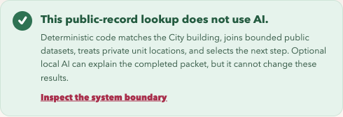
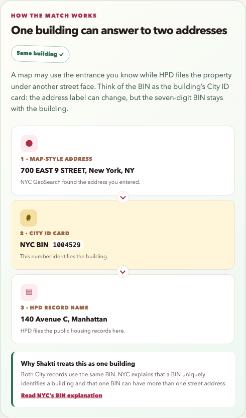

# Deploy the AI free public web edition

The Netlify edition lets a person try Shakti without installing Python or a
local model. It serves the same interface, calls live City services through
serverless functions, and returns source receipts and a hash chained processing
record. It does not run Hermes, Bonsai, or any other model.

The production URL is
[shakti-seva-studio.netlify.app](https://shakti-seva-studio.netlify.app).

## What proves that it is not AI

This is an architectural property, not a marketing label.

1. The production bundle contains four static files and three JavaScript
   functions. It contains no Python runtime or model client.
2. `/api/health` returns `runtime: netlify-functions`, `transport: https`,
   `ai.enabled: false`, and `hermes: null`.
3. The source allowlist, normalization, record limits, privacy treatment, and
   routing policy are ordinary functions in
   `netlify/functions/_shared/civic-data.mjs`.
4. The hosted UI has no Hermes request path. Its local AI card links to the
   repository instead of invoking a model.
5. Every case trace begins with `runtime: netlify-functions` and contains query,
   normalization, routing, and completion events. There is no model event.



The headed acceptance run typed `700 E 9th St` into the deployed site. Live NYC
GeoSearch returned BIN `1004529`, and the function joined HPD Building `6533`.



## Request path

```text
browser
  -> POST /api/address-suggestions
     -> NYC GeoSearch
  -> person accepts a City suggestion
  -> POST /api/case with a BIN or bounded address fields
     -> HPD Buildings
     -> HPD Complaints and Problems
     -> Housing Maintenance Code Violations
     -> Alternative Enforcement Program Buildings
  -> treated case + source receipts + ephemeral trace
```

Both endpoints use POST bodies, so a typed address does not appear in the request
URL. Responses use `Cache-Control: no-store`. The functions do not write a
database or intentionally log the body. Netlify still handles standard
infrastructure metadata, and City services receive the treated lookup needed to
answer the request.

## Netlify primitives

| Blocker | Netlify primitive | Implementation |
| --- | --- | --- |
| Python and WebSockets do not fit a static host | Functions | Three `.mjs` functions provide health, suggestions, and case construction without another package |
| Local files could leak into a manual deploy | Build configuration | `scripts/build_netlify.mjs` copies only `index.html`, `app.js`, `styles.css`, and the mark into `dist/` |
| Address text could enter URL or cache logs | Functions and cache policy | POST bodies and `no-store` responses prevent application caching |
| Hosted Hermes would blur the product boundary | UI and function contract | Health explicitly disables AI; no hosted model endpoint exists |
| A deployment could weaken browser security | `netlify.toml` headers | Same origin connections, CSP, frame denial, MIME protection, and disabled device permissions |

## Build and preview

The repository adds no JavaScript package dependency.

```bash
node --test netlify/tests/*.test.mjs
netlify build --offline
netlify dev --no-open
```

To create a draft deploy from an authenticated Netlify CLI:

```bash
netlify deploy --message "Deterministic NYC public-data preview"
```

Test the draft URL before promoting it:

```bash
curl -sS https://DEPLOY-URL/api/health | jq
curl -sS -X POST -H 'content-type: application/json' \
  -d '{"q":"700 E 9th St"}' \
  https://DEPLOY-URL/api/address-suggestions | jq
curl -sS -X POST -H 'content-type: application/json' \
  -d '{"type":"case","payload":{"bin":"1004529"}}' \
  https://DEPLOY-URL/api/case | jq
```

Promote only a reviewed build:

```bash
netlify deploy --prod --message "Reviewed deterministic public web release"
```

## Regression suite

The release gate follows three layers.

### Acceptance / E2E

| Test | Journey | Status artifact |
| --- | --- | --- |
| Headed address flow | Type `700 E 9th St`, accept the first City suggestion, load the HPD result | Screenshot, clean browser console, and three HTTP 200 requests |
| Visible AI boundary | Open the page and inspect the runtime badge and explanation | `Live City data · no AI` and `This public-record lookup does not use AI` appear on screen |
| Local extension handoff | Complete a hosted case and follow the local AI link | GitHub local setup opens, and no hosted model request occurs |

### Integration

| Test | Boundary | Automated evidence |
| --- | --- | --- |
| Function case orchestration | HTTP request → four City queries → treated packet → trace | `civic-data.integration.test.mjs` |
| Private autocomplete request | POST body → NYC GeoSearch. The function refuses a query string GET request. | `civic-data.integration.test.mjs` |
| Dual runtime browser transport | Netlify uses HTTPS; local FastAPI uses WebSocket | Python static contract plus headed deployment run |

### Unit: data flow and transforms

| Test | Transform or rule | Automated evidence |
| --- | --- | --- |
| Address normalization | Bounded uppercase form and street suffix expansion | `civic-data.unit.test.mjs` |
| Unit location treatment | Public descriptions remove apartment locations | `civic-data.unit.test.mjs` |
| Deterministic routing | Open Class C violation selects the governed HPD follow-up | `civic-data.unit.test.mjs` |
| Safe fallback | Full GeoSearch fallback cannot silently change the house number | `civic-data.unit.test.mjs` |

## Deployment risks

- City services can be slow, unavailable, rate limited, or changed without this
  repository changing.
- The serverless and Python case services are separate implementations. A data
  contract change needs parity tests in both runtimes.
- The current evidence is a supervised acceptance run, not a concurrent load
  test or a public usability pilot.
- Netlify functions and CDN infrastructure have operational logs and limits.
  Do not send names, narratives, contact details, or other
  sensitive information.
- The public service has no user account, saved case, or shareable resident
  history. Adding those would require a new privacy and threat review.

## Connect `dharmicdata.org`

Use `shakti.dharmicdata.org` for this project and keep the apex available for a
future civic technology portfolio or documentation hub. The Netlify project
must claim the hostname, the `dharmicdata.org` DNS zone must point the `shakti`
CNAME to `shakti-seva-studio.netlify.app`, and HTTPS must finish provisioning
before the link is announced.

Do not redirect the apex until there is a deliberate information architecture
for the rest of Dharmic Data.
